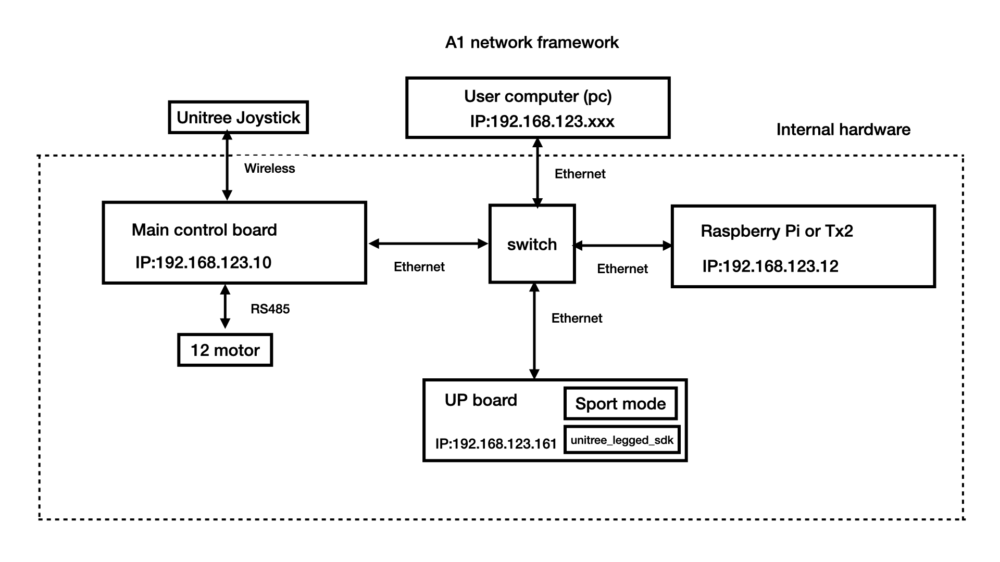
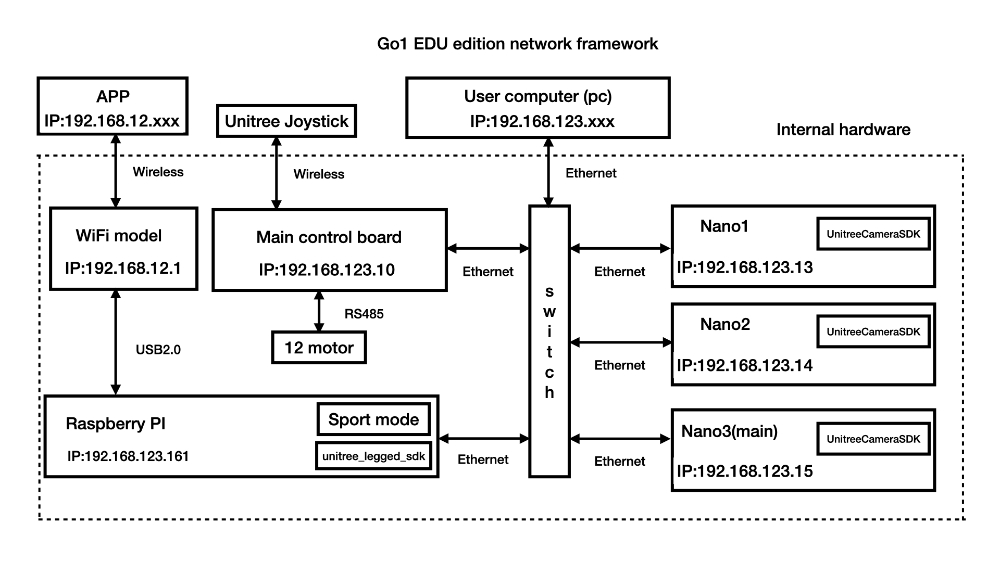
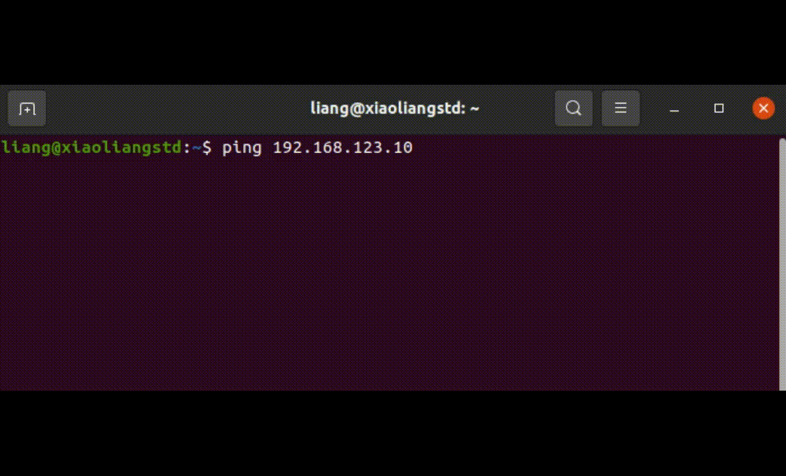

Robot network framework
================
It is necessary to understand the network framework of the robot. After understanding it, you can directly use the personal computer to control the robot, and use the network to transfer files to the robot. It can improve your development efficiency.

A1 network framework
-------------------
There are three onboard computers on the A1 robot. Except for main control board that is not open to the user, the other two are open to the user, one of which is an UP Board and the other is an ARM Raspberry Pi or TX2.
The robot is equipped with a switch in order to allow the three computers to communicate with each other.

Go1 network framework
-------------------
The architecture of network framework of the Go1 robot is similar to that of the A1 robot, but the computing power of the Go1 robot has been significantly increased. There are five computers in the Go1 Education Edition, the same main control board as the A1, a Raspberry Pi 4B and three Jetson nano computers. The five computers are also communicated with each other through a switch.

.. note::

   The framework shown above may be slightly different from the official manual, but it does not affect the use. The IP address of PC needs to be configured before it can communicate with the onboard computer of the robot through the switch.

.. Signal transmission of the control program
.. -------------------

Add user computer to Robot Network
-------------------
In order to use unitree_guide, a feasible method is to copy the code to the robot's onboard computer, and then compile and run it. However, this process is relatively cumbersome, which is not conducive to frequent modification of debugging code. Another better method is to add the user computer to the robot network, communicate directly with the main control board, then send control commands.
Adding the user computer to the robot network is divided into two steps:First, use a network cable to connect the user computer and the switch of the robot.
Second, configure the IP address of the network port of the user computer 
run the following command to open the configuration file
:: 
   sudo gedit /etc/network/interfaces

Then add the following four lines of commands at the end of the file Note that the network port device name needs to be replaced with the user's own network port device name
:: 
   auto {your network port device name}
   iface {your network port device name} inet static
   address 192.168.123.162
   netmask 255.255.255.0

.. note::

   it is necessary to pay attention not to duplicate the IP address of the onboard computer of the robot.

Network-related functions
-------------------
Here are some useful network-related commands: ping, scp.

ping
^^^^
The ping command is used to test whether communication can be established with the specified IP address. 
Here is an example that testing whether communication is established with main control board.
:: 
   ping 192.168.123.10 

if the result similar to the figure shown below, it means that the communication has been established 

..     .. tab:: Introduction
        
..         The function of the ping command is to test whether communication can be established with the specified IP address. 

..     .. tab:: Usage

..         There is an example for testing whether communication is established with main control board. 
        
..         .. code:: console

..            ping 192.168.123.10

scp
^^^
The scp (Secure Copy) command can copy files between multiple computers. For example, to send the unitree_guide package to the Raspberry Pi of the Go1 robot, you can run the following command:
::
    scp unitree_guide pi@192.168.123.161:/home/pi

