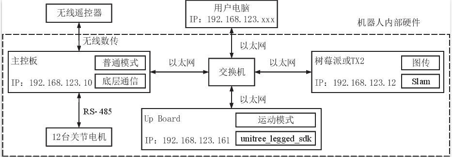

Robot Network
================
It is very important to understand the network of the robot. After understanding it, you can directly use the personal computer to control the robot, and use the network to transfer files to the robot. It can improve your development efficiency.

A1 Network
-------------------
There are three onboard computers on the A1 robot. Except for main control board that is not open to the user, the other two are open to the user, one of which is an UP Board and the other is an ARM Raspberry Pi or TX2.
The robot is equipped with a switch in order to allow the three computers to communicate with each other.

Go1 Network
-------------------
The architecture of network of the Go1 robot is similar to that of the A1 robot, but the computing power of the Go1 robot has been significantly increased. There are five computers in the Go1 Education Edition, the same main control board as the A1, a Raspberry Pi 4B and three Jetson nano computers. The five computers are also communicated with each other through a switch.

.. image:: ../../images/go1_network_framework.png

.. note::

   The framework shown above may be slightly different from the official manual, but it does not affect the use. The PC needs to be configured the IP address before it can communicate with the onboard computer of the robot through the switch.

.. Signal transmission of the control program
.. -------------------

Add user computer to Robot Network
-------------------
In order to use unitree_guide, a feasible method is to copy the code to the robot's onboard computer, and then compile and run it. However, this process is relatively cumbersome, which is not conducive to frequent modification of debugging code. Another better method is to add the user computer to the robot network, communicate directly with the main control board, and send control commands.
Adding the user computer to the robot network is divided into two steps:

1. Use a network cable to connect the user computer and the switch of the robot

2. Configure the IP address of the network port of the user computer

    The network on the robot belongs to the 123 network segment. When configuring the IP address of the user computer, it is necessary to pay attention not to duplicate the IP address of the computer on the robot.

Network-related functions
-------------------
Here are some commonly used network-related commands: ping, ssh.

ping
^^^^
The function of the ping command is to test whether communication can be established with the specified IP address. After completing the network port setting of the user computer, you can use the ping command to test whether the network is connected.
There is an example for testing whether communication is established with main control board. 
::

    ping 192.168.123.10

ssh
^^^

