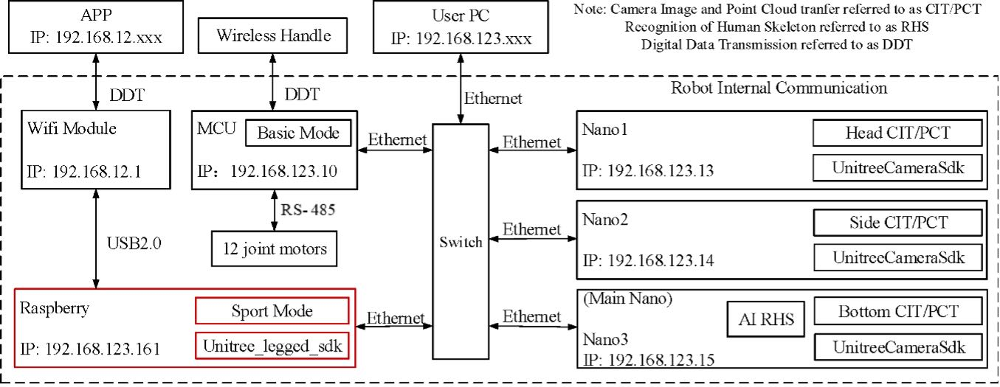

## Hardware interface 

 

A1 Robot Hardware interface

 

1. Raspberry Pi or TX2 HDMI interface 
2. Raspberry Pi or TX2 USB 3.0 port 
3. Raspberry Pi or TX2 USB 2.0 port
4. Ethernet Interface
5. Power input 24V
6. Power input 24V (equivalent to 5v)
7. Serial port(not open to user)
8. Serial port(not open to user)
9. Power output 5V, 2A
10. Power output 12V, 2A
11. Power output 19V, 2A
12. Ethernet interface (equivalent to 4.)
13. UP Board USB 2.0 interface
14. UP Board USB 3.0 interface
15. UP Board HDMI interface

 

Go1 Robot Hardware interface

 

1. Ethernet Interface
2. Raspberry Pi USB interface
3. Raspberry Pi HDMI interface
4. Nano3 (main Nano) USB port
5. Nano3 (main Nano) HDMI port
6. Nano2 USB interface
7. Nano2 HDMI interface
8. External expansion of the body interface
9. Type-C interface (not open to user)
10. Type-C interface (not open to user)
11. Power input 24V

## Robot Network
&emsp;There are three onboard computers on the A1 robot, except for one main control board that is not open to the user.The other two are open to the user, one of which is an X86 UP Board and the other is an ARM Raspberry Pi or TX2.
The other one is an ARM Raspberry Pi or TX2 computer, which is equipped with a switch on the robot in order to allow the three computers to communicate with each other.Then a local area network can be formed.
&emsp;The architecture of the Go1 robot is similar to that of the A1 robot, but the computing power of the Go1 robot has been significantly increased. There are five computers in the Go1 Education Edition, starting with the same main control board as the A1, followed by a Raspberry Pi 4B and three Jetson nano computers.The five computers are also connected to each other through a LAN with a switch.

 

Go1 Robot network architecture

 

## Unitree JoyStick

 

UnitreeJoyStick

 

1. Right joystick
2. Left joystick
3. R1/R2 key
4. L1/L2 key
5. Left arrow key
6. Right arrow key
7. SELECT key
8. START key