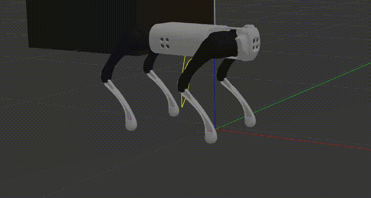
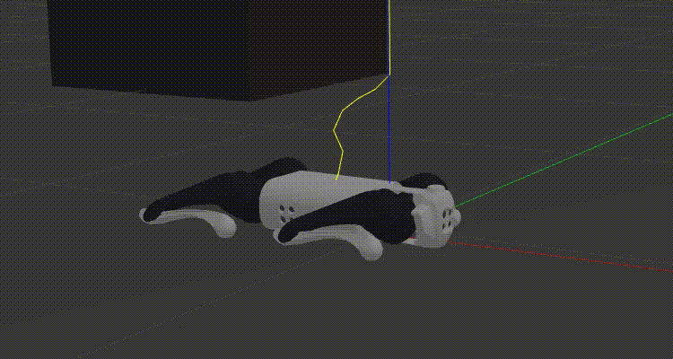
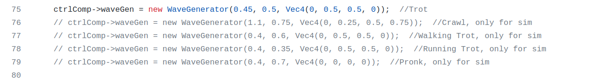

FSM
==========================================
FSM(Finite state machines) are used to manage robot behavior and provide user services. The files related to the FSM are in `FSM`_ folder.

.. _FSM: https://github.com/unitreerobotics/unitree_guide/tree/main/unitree_guide/src/FSM

Passive
-------------------
This is the initial state. In this state, all joints of the robot will go into damping mode and the robot will slowly get down if the robot is standing. This state is also used to deal with emergency situations of the robot, such as falling down.

.. note::

   For emergencies, please refer to FSM::checkSafty().

FixedStand
-------------------
In this state, each joint of the robot will gradually rotate to a given angle and then lock. It is the intermediate state where the robot changes from the Passive state to the Trotting state.

FreeStand
-------------------
In this state, the robot can change the orientation and height of the body according to the command of the joystick or keyboard.

.. image:: ../../images/Practice/freeStand.gif

Trotting
-------------------
In this state, the robot will walk using a given gait.

.. image:: ../../images/gif/trot_new.gif

.. note::
   In simution, press the 'w' 'a' 's' 'd' key to control the translation of the robot, press the 'j' 'l' key to control the rotation of the robot, and press the Spacebar to stop the robot. In real, use the unitree joystick to steer the robot.

you can also control the robot to walk using the crawl gait.

There are many gaits definition in `unitree_guide/main.cpp`_  file. Use other gaits by uncommenting the code shown below, then compiling the unitree_guide again. 

.. _unitree_guide/main.cpp: https://github.com/unitreerobotics/unitree_guide/blob/main/unitree_guide/src/main.cpp

.. note::

   In addition to the trot gait, additional fine tuning of parameters of the other gait might be required when running on real robots.

move_base
-------------------
Navigation and obstacle avoidance mode, the robot will move according to the commands published by ROS move_base.

State switch
-------------------
The image shown below shows the FSM and switching conditions. Each box represents a state, and there are state switching conditions between each of two boxes, and the arrow indicates the direction of state transfer.

.. image:: ../../images/fsmSwitch.png

.. note::
   For example:
   **L2 + A** : This means that you need to press the L2 key and the A key on the unitree joystick at the same time, which is only valid for controlling the real robot.
   **2** : This means that you need to press the 2 key on the keyboard, which is only valid for controlling the sim robot.