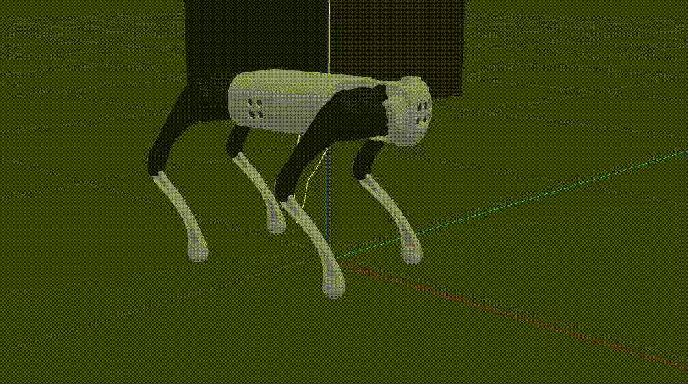

# Experiment6: orientation control of robot in stance
In this practice, we will complete the FreeStand state.In FixedStand state, you need to press **"3"** key on the keyboard or the **"L2+X"** key combination on the handle to enter the FreeStand state. We can use the keyboard or the joystick to change the position and orientation of robot in this state. We use **WASD** key to simulate the left stick of joystick, and **IJKL** key to simulate the right stick. Meanwhile, the spacebar represents returning the value of the left and right joysticks to 0.

 

FreeStand

 

The implementation of this state is through the algorithm introduced in section 6.1.1.
to calculate the position of each foot end in the target pose of the robot.
Then, the target position of each joint is calculated and the joint position is controlled.
Although the algorithm in section 6.1.1 can control the robot in three directions of translation and three directions of rotation
and rotation in three directions, but since there are only two joysticks on the handle
so we can only control four directions, so our program chooses to control the three Euler angles of the body pose
and the height of the fuselage.
Before we introduce the control program, we first introduce the program that contains the robot
class QuadrupedRobot, which contains calculations related to the kinematics of the whole machine.

## QuadrupedRobot Class
1. `getQ(vecP, frame)`:  The inverse kinematics is calculated to obtain the angles of all 12 joints of the current robot.where each column of `vecP` represents the position coordinates of the four foot ends, respectively.
frame represents the coordinate system in which the position coordinates in `vecP` are located.frame can only be `FrameType::HIP`or `FrameType::BODY`.

2. `getQd(pos, vel, frame)`: Inverse differential kinematics is calculated to obtain the angular velocities of all 12 joints of the current robot.where **pos** represents the positions of the four foot ends, the **vel** represents the velocities of the four foot ends, the frame is the same as the function `getQ`.

3. `getTau(q, feetForce)`: The robot statics is calculated to obtain the moments of all 12 joints of the current robot. where **q** represents the angles of the current 12 joints. **feetForce** is the external force of the four foot ends.

4. `getFootPosition(state, id, frame)`: The forward kinematics is calculated to obtain the robot's **id** leg in the **frame** coordinate system.**state** is a structure of type `LowlevelState` which contains all the joint angle information of the robot. **frame** can only be `FrameType::HIP` or `FrameType::BODY`.

5. `getFootVelocity(state, id)`:  Get the position coordinates of all foot ends relative to the center of the frame.The parameter **frame** can be `FrameType::HIP` and `FrameType::BODY`. It can also be `FrameType::GLOBAL`, which represents the world coordinate system.

6. `getFeet2BPositions(state, frame)`:

## FreeStand state
The code for the FreeStand state is in the **State_FreeStand.cpp** file.When we first enter the FreeStand state, we will calculate the equation FreeStand in the `enter` function, we will calculate the p_b0(9) in the equation (6.2), which is the variable `_initVecOX` in the program.It will also calculate p_si in equation (6.1), the respectively, for the four columns of the variable `_initVecXP` in the program.
In the membership function `_calcOP`, we use the target
Euler angle and the target fuselage height, we calculate Tsb in the equation
fuselage target attitude
and its inverse matrix \lstinline{Tbs}.
Then we can use the equation \ (\ref{eq:the coordinates of the foot end in the computer body coordinate system}) to calculate
the target position of each foot end in the airframe coordinate system $\{s\}$, the
respectively, for the four columns of the variable \lstinline{vecOP}.
Finally, in the member function \lstinline{_calcCmd}
the target angle of each joint is found according to the target position of the foot end
and assign it to each joint in _lowCmd}.
The whole process of body posture control is completed.