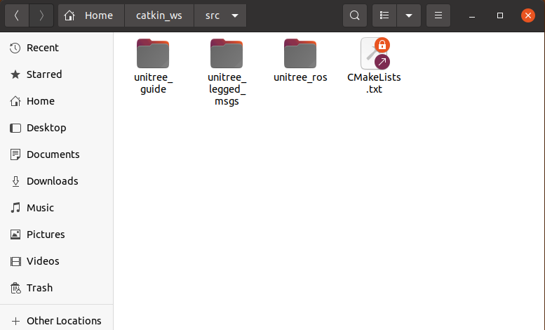
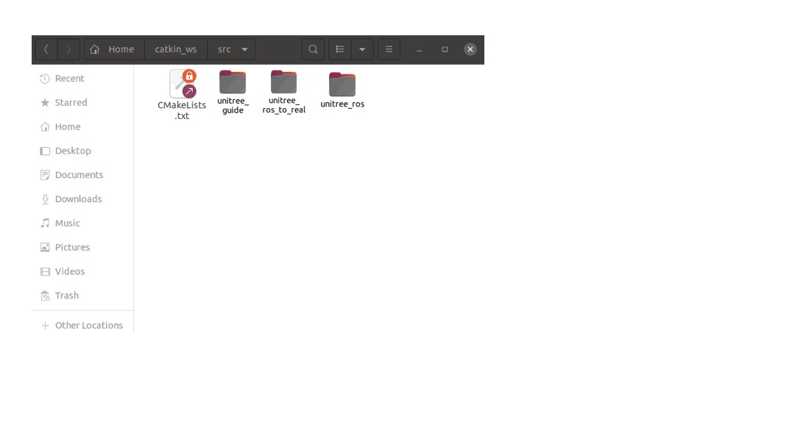
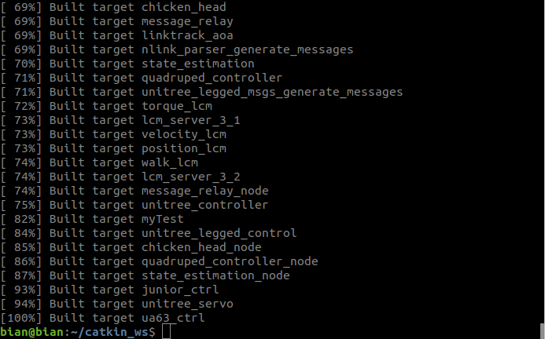

# Installation
## Dependencies

### Environment dependencies 
1. A computer running Ubuntu 18.04 system<br>
 <font size=2>Newer are also available, but haven't tested</font>

2. ROS melodic<br> 
<font size=2>Newer are also available, but haven't tested</font>

3. Python2 <br>
<font size=2>No needed if the DEBUG option is set to off</font>

4. [LCM](https://github.com/lcm-proj/lcm)<br>
<font size=2>Run `lcm-tester` command to test whether there is already this dependency</font>

5. pthread<br>
<font size=2>Run `getconf GNU_LIBPTHREAD_VERSION` command to test whether there is already this dependency</font>

### Package dependencies
1. [unitree_guide](https://github.com/unitreerobotics/unitree_guide)
2. [unitree_ros](https://github.com/unitreerobotics/unitree_ros)
3. [unitree_legged_msgs](https://github.com/unitreerobotics/unitree_ros_to_real)<br>
<font size=2>Note that: unitree_legged_real package should not be a part of dependencies</font>

Download and put packages in the src folder of someone ROS workspace(catkin_ws here).




## CMakeLists.txt
The program of Unitree_guide supports many scenarios. To easily switch between these scenarios, we need to rely on conditional compilation. We can let the compiler to compile what we want with a simple setup. The settings for conditional compilation are in the [unitree_guide/CMakeLists.txt](https://github.com/unitreerobotics/unitree_guide/blob/main/unitree_guide/CMakeLists.txt) 
file, which is at the beginning of CMakeLists.txt.



```
    set(ROBOT_TYPE Go1)        # Robot model,  supporting Go1 and A1
    set(PLATFORM amd64)        # Program compilation platform, supporting amd64 and arm64
    set(CATKIN_MAKE ON)        # Whether to use catkin_make, ON or OFF
    set(SIMULATION ON)         # For Gazebo simulation, ON or OFF
    set(REAL_ROBOT OFF)        # For real robot control, ON or OFF,it must be different from the previous one
    set(DEBUG OFF)              # Whether to turn on Debug mode, ON or OFF
    set(MOVE_BASE OFF)          # Whether to turn on the move_base navigation function, ON or OFF
```
1. set(ROBOT_TYPE Go1):   
The meaning of this line is setting the unitree_guide to support the Go1 robot. Changing Go1 to A1 to support A1 robot, like set(ROBOT_TYPE A1). 


2. set(PLATFORM amd64): <br>
The second line is to decide which platform the unitree_guide will run on, if it runs on a PC and the upboard of A1,  set(PLATFORM amd64). If it runs on the onboard computer of Go1, set(PLATFORM arm64).

3. set(CATKIN_MAKE ON) : <br>
The third line decides whether to use the Catkin_make compiler to compile unitree_guide. If unitree_guide runs on the real robot, the ros system is not installed on the real robot, so you must choose OFF, like set(CATKIN_MAKE OFF).

4. set(SIMULATION ON) and set(REAL_ROBOT OFF)  : <br>
The fourth and fifth line together determine whether the unitree_guide controls the simulated robot or the real robot.

5. set(DEBUG OFF): <br>
This line determine whether open the Debug mode, the Debug mode needs Python2 dependencies, so you can use the OFF option when you first run.

6. set(MOVE_BASE OFF) : <br>
This line determine whether open the MOVE_BASE, you can also use the OFF option when you first run.

## Build and Run
### simulation (gazebo)

Firstly configuring the CMakeLists.txt file, open a terminal and switch the directory to the ros workspace containing unitree_guide, then run the following command to build the project:

```
catkin_make
```

If the terminal looks like the image below and no errors are reported, it means the compilation was successful.


<center>
<br>
<div style="color:orange; border-bottom: 0.1px solid #d9d9d9;
display: inline-block;
color: #999;
padding: 1px;">Compile successfully</div>
</center>
<br>


In the same terminal, run the following command step by step:
```
source ./devel/setup.bash
```
To open the gazebo simulator, run:
```
roslaunch unitree_guide gazeboSim.launch 
```
For starting the controller, open an another terminal and switch to the same directory, then run the following command:
```
./devel/lib/unitree_guide/junior_ctrl
```


### real 
Copy the unitree_guide package to robot's onboard computer. It is recommended to put it directly under the Home folder. Consider that there is no ROS and Python on the UP Board of the A1 robot. we cannot use the catkin_make command of ROS to compile the program. Nor can we use the PyPlot class to draw line graphs. So we need to change the  CMakeLists.txt as follow.
```
    set(PLATFORM amd64)         
    set(CATKIN_MAKE OFF)            
    set(SIMULATION OFF)             
    set(REAL_ROBOT ON)              
    set(DEBUG OFF)                  
    set(MOVE_BASE OFF)          
```
After completing the changes to the CMakeLists.txt file.  Use the scp function described in above section.  Send the unitree_guide folder to the Home directory of the robot's onboard computer. For the UP Board of the A1 robot, this Home directory is /home/unitree. For the Go1 robot's Raspberry Pi it is /home/pi. <br>
Then open an terminal and switch the directory to the unitree_guide folder. Then use mkdir command to create two folders, build and bin.

```
 mkdir build bin        
```
The build folder holds the compiled intermediate files.
And the executable files will be output to the bin folder. Go to the build folder and execute the following two commands step by step
```
  cmake ..
  make     
```
Then in the bin folder, execute the following command to run controller.
```
 sudo ./junior_ctrl  
```

<!-- ## Anomalies -->