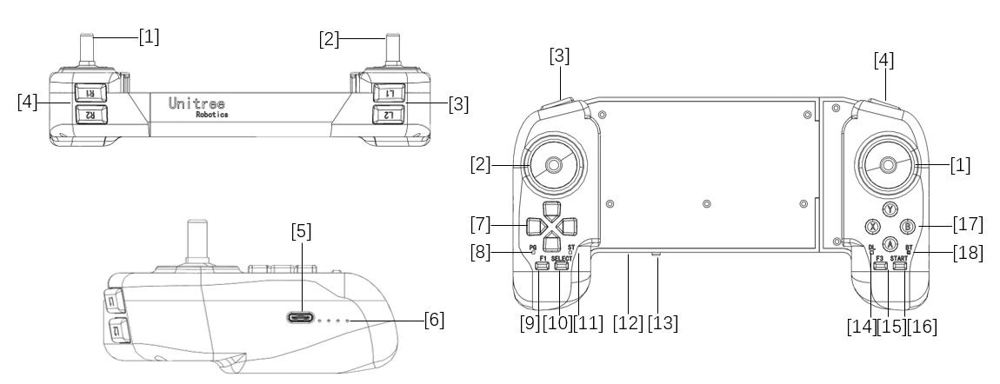

# common

## Hardware interface 

 

A1 Robot Hardware interface

 

 

Go1 Robot Hardware interface

 

## Robot Network

 

Go1 Robot Communication Framework

 

## Unitree JoyStick

 

UnitreeJoyStick

 