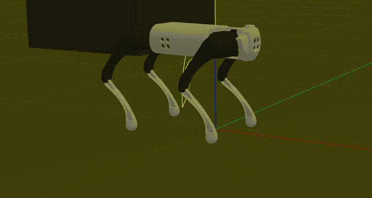
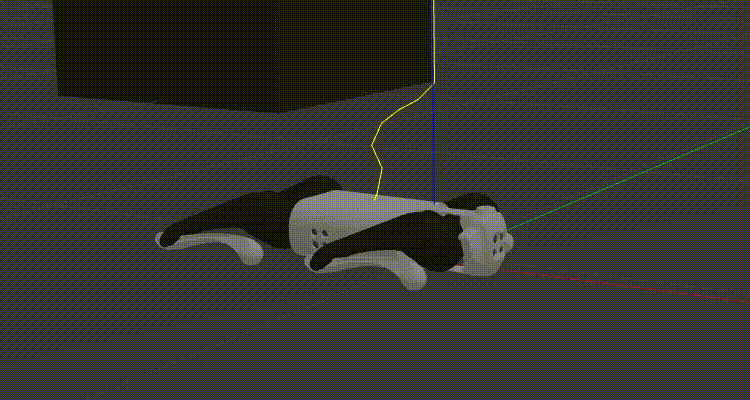
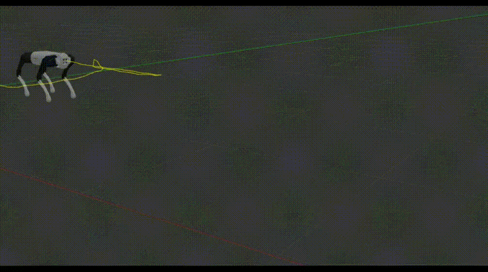
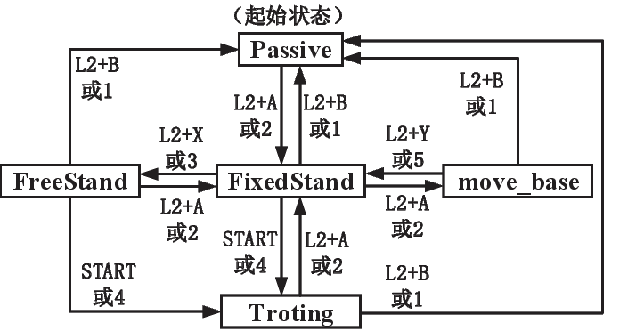

# Finite state machine
## FSM
### Passive
Damping mode,all joints of the robot will go into damping mode and the robot will slowly get down.

 

passive

 

### FixedStand 
Stationary stance, where the joints of the robot are gradually rotated to a given value and locked, at which point the robot is able to maintain a stationary stance.

 

FixedStand

 

### FreeStand
Free standing, where the robot remains standing but can change its stance and height based on commands from the joystick or keyboard.

 

FreeStand

 

### Trotting 
Trotting gait, when the robot will walk using a Trotting gait.

 

Trotting

 

### move_base
Navigation and obstacle avoidance mode, the robot will move according to the commands issued by ROS move_base.

## Switch

 

FSM framework

 