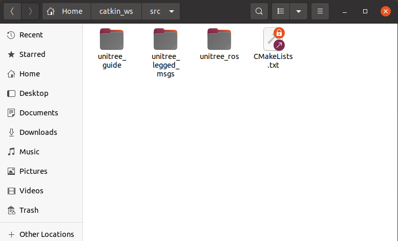
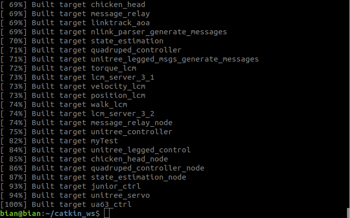

# Installation
## Dependencies

### Environment dependencies 
1. A computer running Ubuntu 18.04 system
2. ROS melodic 
3. Python2
4. [LCM](https://github.com/lcm-proj/lcm)
5. pthread 
### Package dependencies
1. [unitree_guide](https://github.com/unitreerobotics/unitree_guide)
2. [unitree_ros](https://github.com/unitreerobotics/unitree_ros)
3. [unitree_legged_msgs](https://github.com/unitreerobotics/unitree_ros_to_real)(Note that: unitree_legged_real package should not be a part of dependencies)

Download and put these three packages in the src folder of someone ROS workspace(catkin_ws here).


<center>
<br>
<div style="color:orange; border-bottom: 0.1px solid #d9d9d9;
display: inline-block;
color: #999;
padding: 1px;">All the packages that you need to prepare in someone ros workspace</div>
</center>
<br>

## CMakeLists.txt
The program of Unitree_guide supports many scenarios.To easily switch between these scenarios, we need to rely on conditional compilation. We can let the compiler to compile what we want with a simple setup. The settings for conditional compilation are all in the **unitree_guide/CMakeLists.txt** file,which is at the beginning of CMakeLists.txt.
```
    set(ROBOT_TYPE Go1)        # Robot model,  supporting Go1 and A1
    set(PLATFORM amd64)        # Program compilation platform, supporting amd64 and arm64
    set(CATKIN_MAKE ON)        # Whether to use catkin_make, ON or OFF
    set(SIMULATION ON)         # For Gazebo simulation, ON or OFF
    set(REAL_ROBOT OFF)        # For real robot control, ON or OFF,it must be different from the previous one
    set(DEBUG OFF)              # Whether to turn on Debug mode, ON or OFF
    set(MOVE_BASE OFF)          # Whether to turn on the move_base navigation function, ON or OFF
```
The meaning of the first line of above code is set the program to support the Go1 paltfrom. Changing `Go1` to `A1` to support A1 platform, like `set(ROBOT_TYPE A1)`. The second line is to decide which platform the code will run on, if it runs on a PC, which is usually `amd64`.The third and fourth line together determine the program controls the simulated robot or the physical robot.

## Build code and run in sim
In the following we will verify the control program in the Gazebo simulation. the reader should pay attention to CMakeLists.txt. set `ROBOT_TYPE` in it to their robot model.
and set `SIMULATION` to `ON`. `REAL_ROBOT` is set to `OFF`.
```
    set(ROBOT_TYPE Go1)        
    set(PLATFORM amd64)       
    set(CATKIN_MAKE ON)       
    set(SIMULATION ON)         
    set(REAL_ROBOT OFF)       
    set(DEBUG ON)              
    set(MOVE_BASE ON)          
```
After configuring the CMakeLists.txt file, simply go to the catkin_ws folder and type catkin_make and run it.If it looks like the image below and no errors are reported, it means the compilation was successful.

<center>
<br>
<div style="color:orange; border-bottom: 0.1px solid #d9d9d9;
display: inline-block;
color: #999;
padding: 1px;">Compile successfully</div>
</center>
<br>

## Build code and run in real 
First copy the entire **unitree_guide** folder to robot's onboard computer. It is recommended to put it directly under the **Home** folder.Considering that there is no ROS and Python on the UP Board of the A1 robot.we cannot use the `catkin_make` command of ROS to compile the program. Nor can we use the PyPlot class to draw line graphs.So we need to change the following property in CMakeLists.txt.
```
    set(PLATFORM amd64)         
    set(CATKIN_MAKE OFF)            
    set(SIMULATION OFF)             
    set(REAL_ROBOT ON)              
    set(DEBUG OFF)                  
    set(MOVE_BASE OFF)          
```
About the PLATFORM variable.
It indicates the architecture of the computer, for example, the 64-bit personal computer we commonly use is the **amd64** architecture.The UP Board on A1 is also **amd64** architecture.The control computer of Go1 is Raspberry Pi, which is **arm64** architecture.<br>
After completing the changes to the CMakeLists.txt file. Use the scp function described in above section. Send the unitree_guide folder to the Home directory of the robot's onboard computer. For the UP Board of the A1 robot, this Home directory is /home/unitree. For the Go1 robot's Raspberry Pi it is /home/pi.Of course, the reader can also copy the unitree_guide folder to the Home directory manually using a USB stick.<br>
Then open an terminal and move the path to the unitree_guide folder. Then use `mkdir` command to create two folders, build and bin.
```
 mkdir build bin        
```
The build folder holds the compiled intermediate files.
And the compiled executable files will be output to the bin folder. Go to the build folder and execute the following two commands in sequence.
```
  cmake ..
  make     
```
Then in the bin folder, execute the following command to run our quadruped robot control program.
```
 sudo ./junior_ctrl  
```