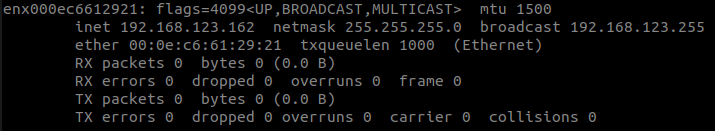

# Practice3: Control real robots and configure networks
## Control program of the robot
&emsp;We take the motion mode of the A1 robot as an example to explain how the robot's control program controls the robot.
From [A1 Robot network architecture](../GettingStarted/common.md),we can see that the robot's motion mode program runs on the UP Board.
However, the UP Board is not connected to the joint motor by RS-485 communication, so it cannot send the joint commands obtained from the motion pattern calculation directly to the motor.
At this point, we need to use a switch to establish Ethernet communication between the UP Board and the main control board.
Then use the unitree_legged_sdk library to send the joint commands from the UP Board to the main control board.
The master board can then distribute the commands to each motor via RS-485.
Then the current status of each motor and the commands from the wireless remote control are returned to the UP Board.

## Join the user computer to the local area network
&emsp;Joining user computers to the LAN is a two-step process:
1. The first step is to connect our user computer to the robot's switch with a network cable.
As shown in Figure  [A1 Robot network architecture](../GettingStarted/common.md)
The robots have both Ethernet ports on their backs.
One of the A1 robots has two Ethernet ports, and both Ethernet ports are directly connected to the switch, so they are equivalent.
Connect one end of the network cable to either of the Ethernet ports on the robot's back and the other end to the computer.
If the only Ethernet port on the computer is already occupied by a wired network, then it is recommended to choose a USB Gigabit port to connect to the robot. 
2. The second step is to configure the IP address of the computer network port.
The LAN on the robot belongs to the 123 network segment, and under the current network settings of the switch, the IP addresses of the devices on the LAN all need to be
192.168.123.xxx format.
When configuring the IP addresses of our own user computers, we also need to be careful not to duplicate the IP addresses of the computers on the robot.
Here we recommend that readers set their own computer IP to a fixed IP: 192.168.123.162. 

&emsp;First check the device name of the current computer Internet port。Open a terminal, type the `ifconfig` command and enter to execute it. You will get a result similar as follow.

 

run ifconfig to view network port device name

 

The `ifconfig` command allows you to view the device names and network settings of all network ports on the current computer.
Taking the network port shown in the figure above as an example, we care about the following three attributes:
1. Device name of the network port: enx000ec6612921
2. IP address (inet): 192.168.123.162
3. Subnet mask (netmask): 255.255.255.0

The device name of the network port is not the same on different computers, so readers should refer to the device name of the network port on their own computers.
And the values of IP address and subnet mask may not be the same as in Figure \ref{fig:ifconfig view network port device name}.
This is normal, next we can run the following command to configure the IP address and subnet mask of the network port.

~~~
sudo ifconfig enx000ec6612921 down
sudo ifconfig enx000ec6612921 up 192.168.123.162 netmask 255.255.255.0
~~~
Note that the **device name** in the command should be replaced with the user's own network port device name. After running and then executing the \lstinline{ifconfig} command to view
You should see that the IP address and subnet mask values are the same as Figure \ref{fig:ifconfig view network port device name}.
This will allow our own user computer to connect to the robot's LAN. 

In order to automatically configure the settings of the network interface every time the computer is booted, we can modify the
\lstinline{/etc/network/interfaces} to keep the settings for that network port.
Start by running the following command to open and modify the file.
~~~
sudo gedit /etc/network/interfaces
~~~
Add the following four lines to the end of the interfaces file (note that the network port device name needs to be replaced with the user's own network port device name).
~~~
auto enx000ec6612921
iface enx000ec6612921 inet static
address 192.168.123.162
netmask 255.255.255.0
~~~