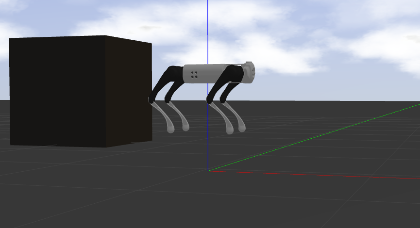

# Practice5: Let the legs moving 
The control of a quadruped robot is a combination of many sub-control systems.
So when there is a problem with the robot algorithm, or when parameters need to be adjusted
we often have no way to do so. This is because it is difficult to determine the source of the problem.
It is also difficult to observe the performance of the robot after modifying the parameters.
Therefore, we test and adjust the parameters of each subsystem of the robot.
To do this easily, we can add states to the finite state machine for testing.
For example, to facilitate our debugging of the motion of the robot's legs
we add the state \lstinline{SwingTest}.
The reader can see the code under the **src/FSM/State_SwingTest.cpp** file.
to see the relevant code.

In the state **SwingTest**, after obtaining the target position of the right front leg
you can use the function `_positionCtrl` to calculate the target angle of each joint.
The function `_torqueCtrl` is used to calculate the target force at the foot end.
The target moment of each joint is obtained.

## Robot kinematics and hydrostatic calculations
In the sample code, we abstract the robot's legs into a class.and abstract the calculations related to the robot's kinematics and statics as member functions of this class.
Open the file **include/common/unitreeLeg.h** .
We can see the class `QuadrupedLeg`, which is a three DOF mechanical leg of the robot.
We will explain each of its member functions separately.
1. `QuadrupedLeg`: constructor of class QuadrupedLeg,The parameter `legID` is the leg number.The last `pHip2B` represents the length from the center of the body
to the origin of that leg base coordinate system 0 as a vector.

2. `calcPEe2H(q)`: 
 With reference to equation (5.11), the calculate when each of the three joint angles is q the vector coordinates of the foot end to the origin of the base coordinate system 0.

3. `calcPEe2B(q)`: 
Calculate when each of the three joint angles is q the vector coordinates from the foot end to the center of the body.

4. `calcVEe(q, qd)`: 
With reference to equation (5.42), the Calculate when the joint angle is q, the the angular velocity of the joint is qd, the The velocity vector of the foot end.

5. `calcQ(pEe, frame)`: 
Referring to the inverse kinematics in section 5.2, the Calculate when the coordinates of the foot end are `pEe` the angles of the three joints on the leg, and \lstinline{frame denotes the coordinate system in which the coordinates `pEe` can be `FrameType::HIP` or `FrameType::BODY`, representing the base coordinate system 0 and the fuselage coordinate system 0, respectively.and the fuselage coordinate system.

6. `calcQd(q, vEe)`: 
With reference to equation (5.43) Calculate the angles and foot-end velocities of the three joints on the current leg based on the the angular velocities of the three joints.

7. `calcQd(pEe, vEe, frame)`: 
Based on the position coordinates of the foot end in the frame coordinate system `pEe` and the velocity `vEe` to calculate the angular velocities of the three joints.It can be considered as a fusion of the functions `calcQd(q, vEe)` and function `calcQ(pEe, frame)`.

8. `calcTau(q, force)`: 
Referring to equation (5.46), the Calculated when the angle of the three joints of the leg is q and the external force at the end of the foot is force. The moment of the three joints of the leg.
9. `calcJaco(q)`: 
With reference to equation (5.42), the calculate when each of the three joint angles is q the Jacobi matrix of this leg.

## Experimentation on simulation and real machines
The state **SwingTest** can only be accessed from the
state **FixedStand**.
So you need to press the **"2"** key on the keyboard or the **"L2+A"** key combination on the joystick first
to enter the **FixedStand** state.
Then press **"9"** on the keyboard or **"L1+A"** on the joystick
Enter the SwingTest state. 

Note that we would like to see the motion of the right front leg in the vacant state.
So in the simulation we also want to test the robot suspended.
The way to achieve this is to assign the parameter `user_debug`
to `true`.
~~~
 roslaunch unitree_guide gazeboSim.launch user_debug:=true
~~~
In our previous simulation, the value of `user_debug` was not modified.
So its default has been false, when the robot can move in the simulation space.
And when we assign `user_debug` to `true`, the
the robot will hang in the initial position, thus making it easier for us to observe the movement of the legs.
It is also desirable to hang the robot for experiments when running on the real machine.

 

 the robot will be hung on When user_debug is set to true,

 