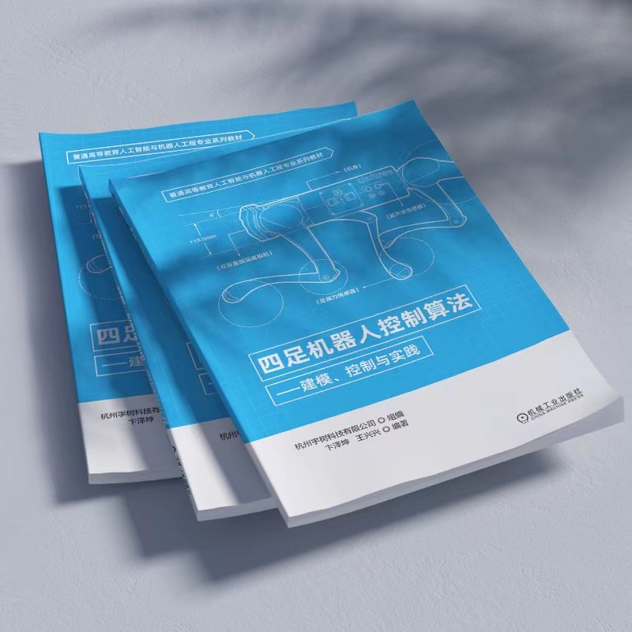

.. unitreeArm-docs documentation master file, created by
   sphinx-quickstart on Thu Jul 14 15:04:31 2022.
   You can adapt this file completely to your liking, but it should at least
   contain the root `toctree` directive.

Welcome to unitree_guide documentation!
===========================================
The `unitree_guide`_ is an open source project for controlling the quadruped robot of Unitree Robotics, and it is also the software project accompanying 
`<<四足机器人控制算法--建模、控制与实践>>`_ published by Unitree Robotics.

.. _<<四足机器人控制算法--建模、控制与实践>>: https://detail.tmall.com/item.htm?id=704510718152

.. note::

   Copyright (c) 2020-2023, Unitree Robotics.Co.Ltd. All rights reserved.

.. note::

   Unitree_guide provides a basic quadruped robot controller for beginners. 
   To achive better performance, additional fine tuning of parameters might be required. 
   Any contribution and good idea from the robotics community are all welcome. 
   Feel free to `raise an issue`_
   
.. _unitree_guide: https://github.com/unitreerobotics/unitree_guide

.. _raise an issue: https://github.com/unitreerobotics/unitree_guide/issues

Table of Contents
==========================================

.. toctree::
   :maxdepth: 4

   docs/Common/index.rst
   docs/GettinStarted/index.rst
   docs/References/index.rst

   
